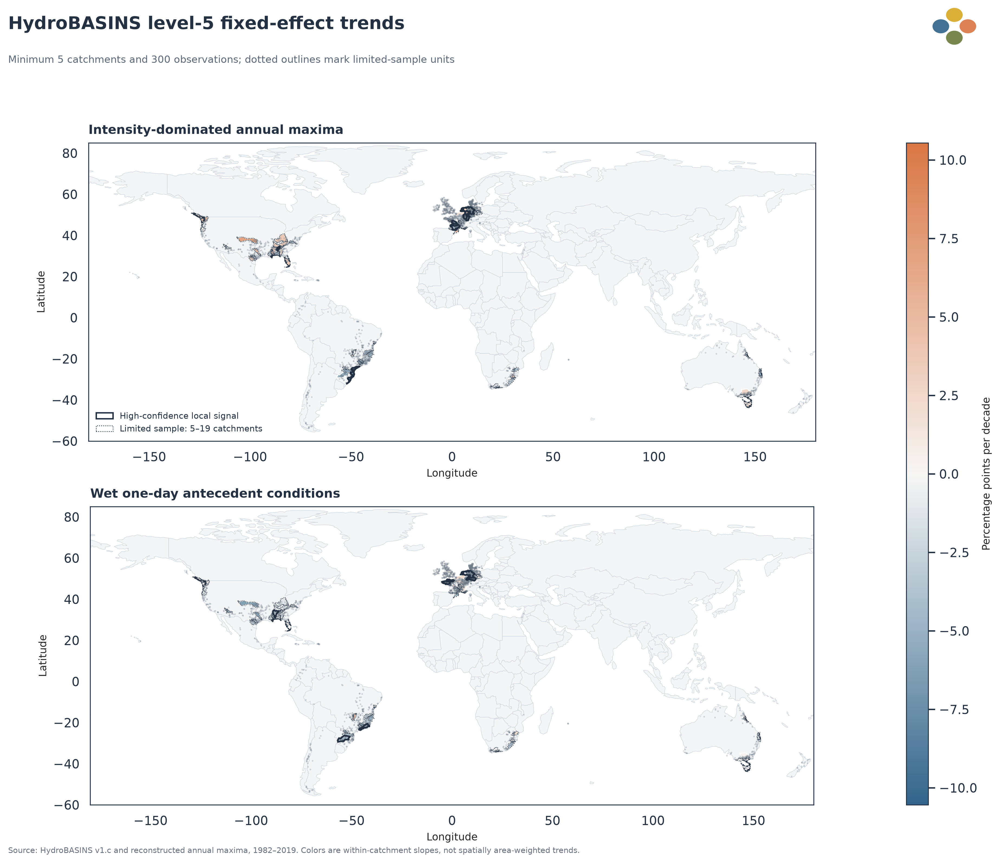
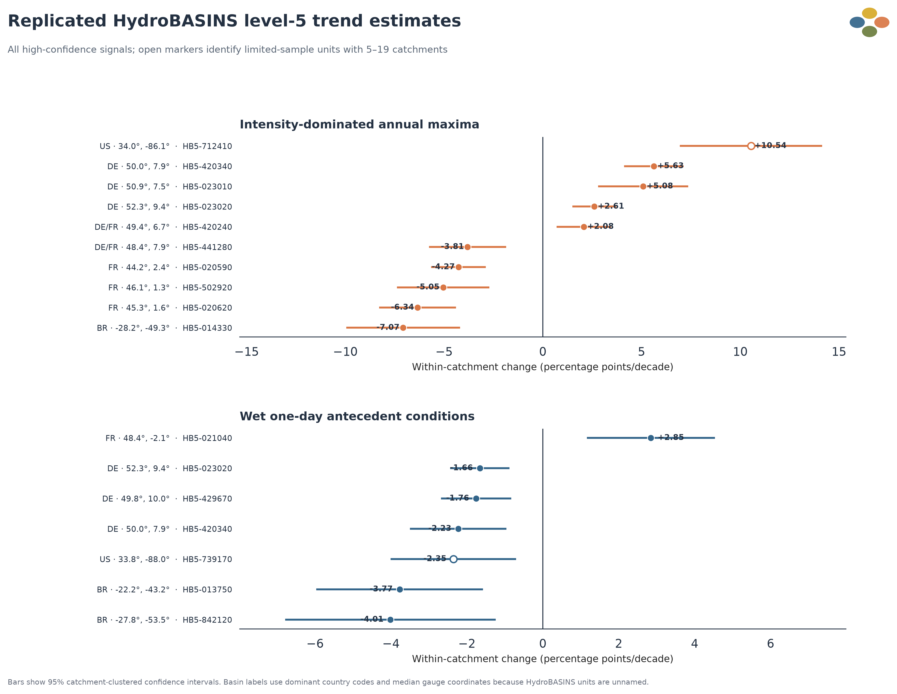
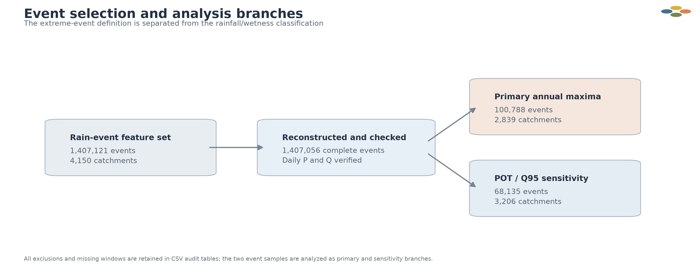

# 降雨型大洪水成因变化的局地水文区格局（1982–2019）

**技术研究报告 · 2026-08-17**

## 技术摘要

- 本研究关注的核心问题是：**哪些由相邻流域构成的水文小区域，出现了可复现的洪水成因条件变化？** 分析对象为 2,839 个低雪比例流域中的 100,788 个年度最大洪水事件，覆盖 1982–2019 年。
- 2,835 个流域可匹配到 HydroBASINS 嵌套水文单元。主分析采用 5 级单元，并仅估计至少包含 5 个流域和 300 个事件观测的区域，共得到 72 个可分析水文区；其中 44 个单元包含 5–19 个流域，作为有限样本结果单独标识。
- 72 个水文区 × 2 个主指标构成 144 个预设检验。36 个结果通过主检验族 5% FDR；其中 **17 个水文区—指标信号**进一步满足替代极端样本、早晚期配对、分类定义方向和逐一剔除流域稳定性要求。
- 高置信度信号中，强度主导比例的变化为每十年 **−7.07 至 +10.54 个百分点**，1 天湿润前期条件比例为 **−4.01 至 +2.85 个百分点**。这些变化集中在巴西南部、法国、德国和美国部分水文区，并呈现相反方向。
- 17 个信号中有 12 个在 HydroBASINS 3、4、5 级尺度上方向一致；其余 5 个限定在 5 级局地单元。证据表明，洪水成因演变主要表现为**局地化、方向相反的水文区变化**，而不是空间一致的全球过程。

## 1. 局地水文区出现数个百分点量级的成因变化

局地趋势地图展示 72 个合格 HydroBASINS 5 级单元的流域固定效应斜率。颜色表示同一水文区内、同一流域随时间的平均变化；描边标记通过完整高置信度筛选的信号。包含 5–19 个流域的 44 个单元属于有限样本估计，需要比至少包含 20 个流域的单元更谨慎地解释。该结果不是按地图逐格搜索热点，而是在按样本量预先确定的水文单元和两个主指标上统一估计。

主指标分别是：

- **强度主导比例**：事件最大日降雨占事件总降雨的比例大于 0.50；
- **湿润前期条件比例**：事件开始前 1 天的土壤饱和指数 `SSI>0.56`。

强度主导比例共有 10 个高置信度局地信号，1 天湿润前期条件共有 7 个。两类指标都同时包含增加和减少区域，说明其空间结构不能用单一方向概括。

## 2. 最大局地变化达到每十年约 2–11 个百分点

排序图给出高置信度信号的流域聚类 95% 置信区间。标签使用主要国家代码、区域内测站中位坐标和稳定的 HydroBASINS 编号；这些 5 级水文单元本身没有统一地名。

幅度最大的结果包括：

- 美国 `HB5-712410`（10 个流域）的强度主导比例每十年增加 **10.54 个百分点**（95% CI：6.94 至 14.15；主检验族 `q=0.00168`）。POT/Q95 样本斜率为 +6.81 个百分点/十年，早晚期平均差为 +16.48 个百分点。该单元通过完整稳健性筛选，但因流域数不足 20，仍标记为有限样本信号。
- 巴西南部 `HB5-014330`（23 个流域）的强度主导比例每十年下降 **7.07 个百分点**（95% CI：−9.95 至 −4.19；主检验族 `q=0.00112`）。POT/Q95 样本斜率为 −7.24 个百分点/十年，同流域 1982–2000 与 2001–2019 的平均差为 −15.23 个百分点。
- 法国中南部 `HB5-020620`（39 个流域）的强度主导比例每十年下降 **6.34 个百分点**（−8.28 至 −4.39），早晚期平均差为 −8.27 个百分点。
- 德国西部 `HB5-420340`（43 个流域）的强度主导比例每十年增加 **5.63 个百分点**（4.12 至 7.13）。POT/Q95 样本斜率为 +8.54 个百分点/十年，早晚期平均差为 +7.95 个百分点。
- 巴西南部 `HB5-842120`（24 个流域）的 1 天湿润前期条件比例每十年下降 **4.01 个百分点**（−6.78 至 −1.24），早晚期平均差为 −15.29 个百分点。
- 法国西部 `HB5-021040`（59 个流域）的 1 天湿润前期条件比例每十年增加 **2.85 个百分点**（1.16 至 4.54），早晚期平均差为 +6.15 个百分点。

德国西部 `HB5-420340` 的变化在更粗的父水文区中被邻近区域抵消，而巴西南部 `HB5-014330` 在 3、4、5 级尺度上保持同方向。两种情况分别代表“仅在小区域清楚出现”和“跨嵌套尺度保持”的局地变化结构。

## 3. 有效证据尺度是相邻流域群，而不是孤立测站

单流域检验的统计功效有限。在满足至少 5 次发生和 5 次不发生的 2,516 个流域中，没有单流域强度主导比例趋势通过 5% FDR；837 个可拟合流域的 1 天湿润状态趋势也没有通过 FDR。将至少 5 个相邻流域、且至少 300 个年度事件观测按标准水文边界共同估计后，可以识别在多个测站中共同出现、但单站样本不足以确认的变化。72 个合格单元中，44 个包含 5–19 个流域；这类结果虽然进入统一 FDR 检验族，但聚类数较少，解释时需保留有限样本限定。

这种聚合仍保留水文邻接关系。17 个高置信度信号中，12 个在 3、4、5 级嵌套水文尺度上方向一致；5 个在更大父区域中减弱或反转。大尺度汇总所得到的弱变化，是局地正负信号相互抵消后的结果，不能替代水文区尺度的空间识别。

## 4. 数据范围决定了结论适用边界

主分析样本由欧洲和美洲测站主导：欧洲 1,469 个流域、北美 543 个、南美 493 个、大洋洲 198 个、非洲 132 个，亚洲仅有 4 个流域通过记录长度筛选。图中同时显示进入主分析的流域和因记录条件未进入主分析的流域。

分析限定为长期积雪比例 `<0.10`、休眠季和生长季事件目录均有记录、并具有完整日数据的近自然流域。该范围使 `water_input_mm` 可以解释为降雨，避免将主要融雪过程混入降雨组织指标。研究结论描述的是现有长期测站样本中的局地变化，不是全球陆地面积或流域面积加权估计。

项目从约 167 万个源事件中重建了 1,407,121 个低雪比例雨洪事件。响应期最大日流量被重新提取为洪峰；事件总降雨、最大日降雨和事件前 1、3、7、30 天 SSI 均由日序列重新计算。年度最大洪水构成主样本，POT/Q95 极端事件构成独立敏感性分支。

事件降雨重建值与源事件目录的最大误差为 `5.68e-13 mm`。年度最大样本包含 100,788 个事件和 2,839 个流域；POT/Q95 样本包含 68,135 个事件和 3,206 个流域。

## 5. 局地趋势的估计与高置信度筛选

### 5.1 水文区与样本门槛

流域测站质心被匹配到 [HydroBASINS v1.c](https://www.hydrosheds.org/products/hydrobasins) 的 3、4、5 级嵌套水文单元。毛里求斯 3 个流域和夏威夷 1 个流域未匹配，未采用最近邻强制归属。主尺度为 5 级，只保留至少 5 个流域和 300 个年度最大事件观测的单元；这些门槛仅由样本支持度决定，与趋势大小和显著性无关。300 个观测的附加条件使实际最小单元包含 9 个流域。

### 5.2 趋势模型

每个水文区分别拟合流域固定效应线性概率模型，标准误按流域聚类。模型估计同一批流域内部每十年的比例变化，并控制稳定的流域间差异。主检验族包含 72 个水文区上的强度主导比例和 1 天湿润比例，共 144 个检验；Benjamini–Hochberg 校正在完整主检验族上实施。

### 5.3 高置信度信号条件

一个水文区—指标结果只有同时满足以下条件，才被列为高置信度局地信号：

1. 年度最大洪水固定效应趋势通过主检验族 5% FDR；
2. POT/Q95 极端事件样本给出相同变化方向；
3. 同流域早晚期配对比较方向一致，并通过相应主检验族 FDR；
4. 强度指标在 0.50、联合 CV 和 0.75 定义下方向一致，或湿度指标在 1、3、7 天窗口下方向一致；
5. 逐一剔除水文区内任一流域后，趋势方向不变。

144 个主检验中有 36 个通过 5% FDR，19 个同时通过事件样本和早晚期配对复现要求，17 个进一步通过定义与留一流域稳定性条件。完整方法见 [local_hydrobasin_analysis.md](../docs/methods/local_hydrobasin_analysis.md)。

## 6. 稳健性与解释限制

### 可以支持的结论

- 若干由 10–139 个相邻流域组成的水文小区域，存在每十年约 2–11 个百分点的成因条件比例变化；其中两个高置信度信号来自不足 20 个流域的有限样本单元；
- 局地变化同时包含增加和减少方向，部分信号跨 3、4、5 级水文尺度保持；
- 17 个高置信度信号在替代事件抽样、早晚期配对、分类定义和留一流域检验中保持方向；
- 水文区共同估计比逐站热点检验更适合当前记录长度和事件数量。

### 尚不能支持的解释

- HydroBASINS 单元之间及相邻流域之间可能存在残差空间相关。当前置信区间按流域聚类，仍需空间块自助法或空间相关稳健标准误确认不确定性；
- 日尺度最大降雨描述的是日降雨时间集中度，不能识别小时尺度对流暴雨；
- 固定 SSI 阈值支持一致分类，但不等同于每个流域本地的产流临界湿度；
- 测站集中于欧洲、美洲和澳大利亚，亚洲与非洲代表性不足；
- 分析没有显式控制温度、蒸散、植被、土地利用和人为调控，不能将局地趋势直接归因于人为气候变化或单一物理驱动。

## 7. 结论与下一步分析

本研究的核心结论是：

> 1982–2019 年间，全球低雪比例观测流域的大洪水成因变化主要表现为水文小区域内幅度较大、方向相反的局地演变。17 个高置信度水文区—指标信号达到每十年约 2–11 个百分点，并在替代样本、分期比较和分类敏感性中复现；其中两个来自有限样本单元，需要进一步空间稳健性验证。这些信号在更大尺度汇总时会相互抵消。

下一步分析应直接围绕这些局地信号解释其物理来源：

1. 对 17 个高置信度信号实施空间块自助法或 Conley 型空间相关稳健推断；
2. 按气候区、流域面积和洪水季节进一步分层，检验局地趋势是否对应共同水文背景；
3. 分解降雨总量、持续时间、最大日降雨、事件月份和前期 SSI 的共同变化；
4. 使用小时或 3 小时降雨数据验证强度指标，并以 ESA CCI 或 ERA5-Land 检验湿度信号；
5. 在独立流域数据库中复现幅度最大的美国、巴西、法国和德国水文区结果。

## 8. 尚待回答的问题

- 巴西南部强度主导比例下降是否来自事件持续时间增加，还是最大日降雨相对减弱？
- 德国西部强度主导比例增加为何只在部分 5 级水文单元中清楚出现？
- 法国西部湿润前期条件增加与法国中南部强度主导比例下降是否对应不同洪水季节？
- 采用流域本地湿度临界值后，7 个湿度局地信号是否保持？
- 空间相关稳健推断会保留多少个高置信度局地信号？

## 9. 证据与复现入口

- 数据审计：[data_audit.md](../docs/quality/data_audit.md)
- 分析验证：[validation_report.md](../docs/quality/validation_report.md)
- 局地水文区方法：[local_hydrobasin_analysis.md](../docs/methods/local_hydrobasin_analysis.md)
- 全量实验执行记录：[execution_manifest.md](../docs/quality/execution_manifest.md)
- 复现说明：[reproducibility.md](../docs/reproducibility.md)
- 主要表格：[`outputs/tables/`](../outputs/tables/)
- 全部 PNG/SVG 图件：[`outputs/figures/`](../outputs/figures/)
