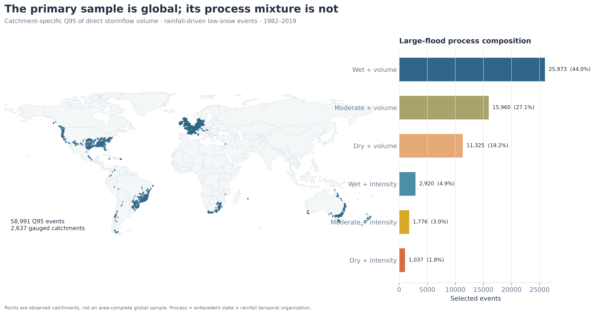
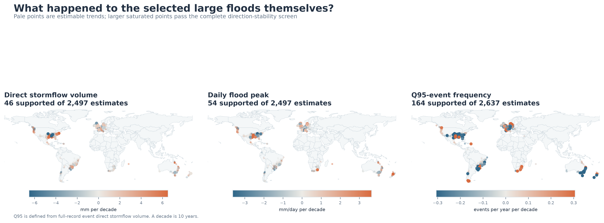
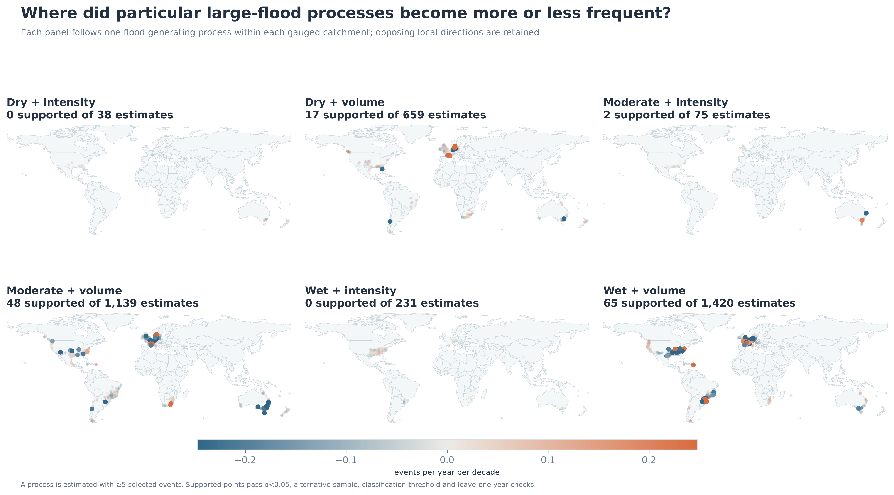
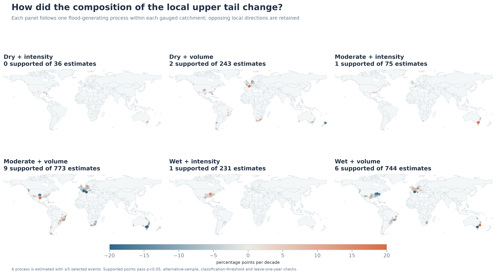
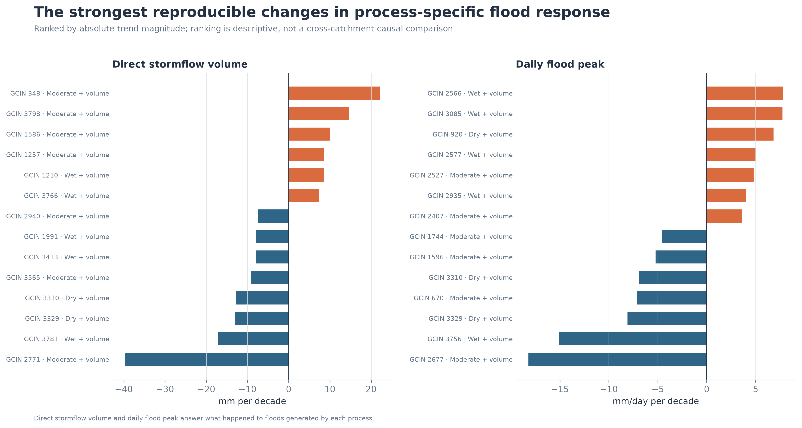
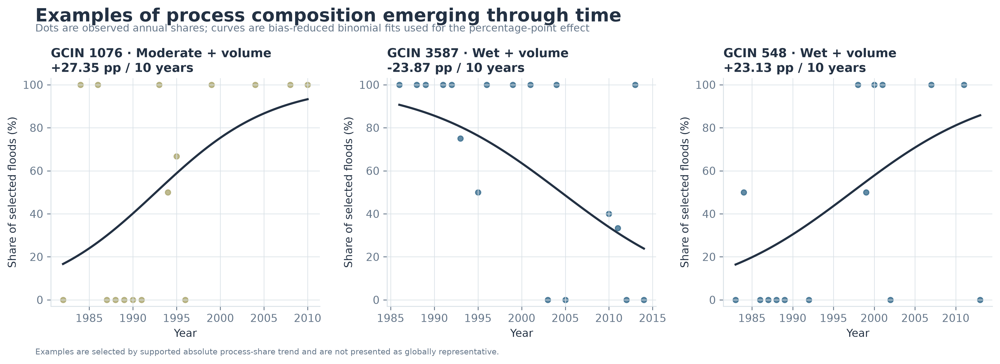

# 全球降雨驱动型大洪水生成机制的长期变化（1982–2019）

**完整技术报告｜事件尺度分类、观测流域趋势与可复现实验**

生成日期：2026-09-04

> **核心结果。** 研究先在每个观测流域中按事件直接径流量选出全记录 Q95 大洪水，再区分六种“前期湿润状态 × 降雨时间组织”机制。结果不是寻找一条全球统一趋势，而是定位哪些观测流域的机制出现频率、机制内部条件或相应洪水响应发生了稳定变化。

## 1. 研究问题

本研究回答三件事：入选的大洪水本身是否变了；这些洪水由什么机制产生；把不同机制分开后，哪些机制的发生频率、组成比例、降雨与前期湿润条件以及洪水量级发生了长期变化。

老师在 2026 年 9 月 2 日会议中强调，混合不同成因会相互抵消时间信号。因此单个观测流域是首要分析单元，机制分类先于趋势解释；地图只显示真实观测流域，不对无资料区域作空间外推。

## 2. 数据与研究边界

- 时间：1982–2019；这是降水、流量和土壤湿润度均可核验的共同记录。
- 对象：低雪影响的降雨驱动事件（流域雪比例 < 0.10）。
- 记录门槛：至少30个事件年份、至少30年跨度、记录覆盖率至少80%。
- 主样本：**58,991** 个Q95事件、**2,637** 个观测流域。
- 空间含义：地图上的点是有观测资料的流域，不代表全球陆地面积均匀采样。

## 3. Q95到底是什么

Q95不是降水的95分位，也不是每年重新计算的日流量95分位。对流域 \(i\)，用完整记录内所有水文事件的**直接径流量** \(Q^{vol}_{ie}\) 计算：

$$
u_i=\operatorname{quantile}_{0.95}\{Q^{vol}_{ie}\}.
$$

满足 \(Q^{vol}_{ie}\ge u_i\) 的事件进入主样本。例如某流域有400场事件，Q95大致选出事件直接径流量最大的20场。Q90、Q97.5和每年最大事件只用于敏感性检验。

## 4. 为什么还要看洪水本身

“生成条件变了”不能代替“洪水响应变了”。因此首先估计入选事件的直接径流量、事件日洪峰和每年Q95事件数。只有把响应与条件并列展示，才能讨论二者是否在同一流域、同一机制中共同变化。

| 结果量 | 可估计流域 | p<0.05 | 通过完整筛选 | 下降 | 上升 |
|---|---:|---:|---:|---:|---:|
| 事件直接径流量 | 2,497 | 123 | 46 | 24 | 22 |
| 事件日洪峰 | 2,497 | 141 | 54 | 31 | 23 |
| Q95事件年频次 | 2,637 | 250 | 164 | 109 | 55 |

## 5. 降雨时间组织的公式和物理含义

设一场事件第 \(d\) 天降雨为 \(P_d\)：

$$
C=\frac{\max_d(P_d)}{\sum_d P_d},\qquad CV_t=\frac{sd(P_d)}{mean(P_d)}.
$$

例如整场降雨70 mm，最多的一天42 mm，则 \(C=0.60\)：60%的事件降雨集中在一天。按照Tarasova等（2020）的日尺度规则，只有 \(C>0.50\) 且 \(CV_t>1\) 才称为**强度型**；其余称为**总量型**。连续的 \(C\) 仍然保留用于趋势计算，标签只用于分组。

## 6. 前期湿润状态

土壤饱和指数（soil saturation index，SSI）在0到1之间，表示土壤储水相对于模型田间持水能力的状态。源事件目录的经验边界约为：\(SSI\leq0.3994\) 为干燥，\(0.3994<SSI\leq0.5640\) 为中等湿润，\(SSI>0.5640\) 为湿润。这里不把中间状态强行塞进干/湿二分，因而不会丢掉大量物理上处于中间状态的事件。

## 7. 六种生成机制

六类分别为干燥–强度型、干燥–总量型、中等湿润–强度型、中等湿润–总量型、湿润–强度型和湿润–总量型。它们是**事件标签**，不是给流域贴上的永久标签；同一流域在不同年份可以出现不同机制。

| 机制 | Q95事件数 | 占主样本 |
|---|---:|---:|
| 湿润–总量型 | 25,973 | 44.0% |
| 中等湿润–总量型 | 15,960 | 27.1% |
| 干燥–总量型 | 11,325 | 19.2% |
| 湿润–强度型 | 2,920 | 4.9% |
| 中等湿润–强度型 | 1,776 | 3.0% |
| 干燥–强度型 | 1,037 | 1.8% |

## 8. 为什么每个机制至少需要5场事件

Tarasova等（2023）在流域尺度机制频次趋势中采用至少5场同类事件，明确说明这是稳健性与可用数据之间的折中。本实验只保留这个单一硬门槛，不再人为设置5–19和≥20两级。

## 9. 同一年有多场事件怎么办

连续变量先在“流域–年份”内平均：

$$
\bar y_{it}=\frac{1}{n_{it}}\sum_e y_{iet}.
$$

例如2004年有三场Q95洪水，直接径流量分别为20、35和50 mm，则该年的趋势输入是35 mm。这样不会因为某一年事件多就获得额外时间权重。频次分析则保留实际事件数，并在有记录但没有该机制事件的年份填0。

## 10. 趋势如何估计

降雨集中度、SSI、径流量和洪峰等连续量使用Theil–Sen斜率：

$$
\hat\beta=\operatorname{median}_{j>k}\frac{y_j-y_k}{t_j-t_k},
$$

显著性使用带重复值校正的Mann–Kendall检验，其排序统计量为

$$
S=\sum_{j>k}\operatorname{sign}(y_j-y_k).
$$

在“没有单调趋势”的零假设下，由重复值校正后的方差计算双侧p值。报告将年斜率乘10，因此“per decade”始终是**每10年**，不是12年。

年度事件数使用Poisson计数趋势：

$$
N_t\sim\operatorname{Poisson}(\mu_t),\qquad
\log\mu_t=a+b\frac{t-2000}{10}.
$$

结果不直接显示对数系数，而换算为拟合年频次的绝对变化。比如某机制从记录初期的0.4场/年变为30年后的0.7场/年，则显示为 \((0.7-0.4)/3=+0.10\) 场/年/10年。这样稀疏年度计数也不会只得到没有信息的“−0.0”。

机制比例使用年度“该机制事件数 / 全部Q95事件数”的偏差修正二项趋势：

$$
s_t\sim\operatorname{Binomial}(n_t,\pi_t),\qquad
\operatorname{logit}(\pi_t)=a+b\frac{t-2000}{10}.
$$

比如拟合比例在20年内从18%变为26%，显示为 \((26-18)/2=+4\) 个百分点/10年。

对SSI、径流量等正值变量，报告还给出辅助相对变化 \(r=100\hat\beta/\bar y\)，不使用对数模型。例如SSI绝对趋势为+0.009/10年、该流域—机制平均SSI为0.45，则相对变化为 \(100\times0.009/0.45=+2.0\%/10年\)。绝对单位仍是主结果，相对值只帮助判断变化相对于当地平均状态有多大。

## 11. p值与证据筛选

每个流域—结果组合直接报告两侧 \(p\) 值；完整支持要求 \(p<0.05\)，并且Q90、Q97.5、年度最大样本方向一致，降雨分类0.40和0.60阈值方向一致，逐年删除任何一年都不反向。

这四项是方向可复现性筛选，不是因果证明。

## 12. 机制发生频率的结果

机制年频次回答“这种机制产生Q95大洪水是否越来越常见”。它比只看总体洪水趋势更贴近老师提出的“分类以后再看时间模式”。

绝对变化幅度最大的支持结果如下；“+”表示该机制产生Q95大洪水的年频次增加，“−”表示减少。

| 流域 | 国家 | 生成机制 | 年频次趋势 |
|---|---|---|---:|
| 2810 | US | 湿润–总量型 | -0.55 events per year per decade |
| 887 | DK | 中等湿润–总量型 | +0.55 events per year per decade |
| 955 | DK | 干燥–总量型 | +0.51 events per year per decade |
| 520 | DE | 湿润–总量型 | -0.46 events per year per decade |
| 51 | DE | 湿润–总量型 | +0.45 events per year per decade |
| 3813 | BR | 湿润–总量型 | +0.44 events per year per decade |
| 682 | DE | 干燥–总量型 | -0.43 events per year per decade |
| 648 | AU | 中等湿润–总量型 | -0.43 events per year per decade |

## 13. 机制组成比例的结果

机制比例回答“在该流域入选的大洪水中，这一机制所占份额是否上升或下降”。它与频次互补：比例增加可能来自该机制变多，也可能来自其他机制减少。

| 流域 | 国家 | 生成机制 | 在Q95大洪水中的占比趋势 |
|---|---|---|---:|
| 1076 | FR | 中等湿润–总量型 | +27.35 percentage points per decade |
| 3587 | AU | 湿润–总量型 | -23.87 percentage points per decade |
| 548 | AU | 湿润–总量型 | +23.13 percentage points per decade |
| 1216 | FR | 中等湿润–总量型 | -22.82 percentage points per decade |
| 1216 | FR | 干燥–总量型 | +22.82 percentage points per decade |
| 703 | AU | 中等湿润–强度型 | +22.54 percentage points per decade |
| 703 | AU | 中等湿润–总量型 | -22.54 percentage points per decade |
| 1734 | AU | 中等湿润–总量型 | -21.90 percentage points per decade |

## 14. 所有机制特异结果的证据数量

| 结果量 | 可估计组合 | p<0.05 | 通过完整筛选 | 下降 | 上升 |
|---|---:|---:|---:|---:|---:|
| 该机制的年频次 | 3,562 | 337 | 132 | 93 | 39 |
| 该机制在入选大洪水中的比例 | 2,102 | 47 | 19 | 13 | 6 |
| 事件直接径流量 | 3,409 | 155 | 63 | 29 | 34 |
| 事件日洪峰 | 3,409 | 170 | 90 | 54 | 36 |
| 该机制内部的降雨集中度 | 3,409 | 162 | 102 | 69 | 33 |
| 该机制内部的前期湿润度 | 3,409 | 186 | 117 | 46 | 71 |

## 15. 机制内部的洪水响应

分类之后分别看直接径流量和日洪峰，回答“由同一种机制产生的洪水是否变大/变小”。这比把所有不同成因事件混合后只拟合一条线更容易发现相互抵消的局部变化。

## 16. 机制内部的条件变化

降雨集中度趋势表示同类事件的降雨是否进一步向单日集中；SSI趋势表示同类事件发生前的流域是否变得更湿或更干。即使事件仍落在同一类别中，连续物理量也可能持续变化，因此分类与连续指标同时保留。

| 流域 | 国家 | 生成机制 | 降雨集中度趋势 |
|---|---|---|---:|
| 3060 | US | 湿润–总量型 | -18.28 percentage points per decade |
| 2981 | US | 湿润–总量型 | +14.46 percentage points per decade |
| 1311 | FR | 湿润–总量型 | -13.17 percentage points per decade |
| 896 | DK | 干燥–总量型 | +13.02 percentage points per decade |
| 3332 | ZA | 干燥–总量型 | -11.68 percentage points per decade |
| 3181 | US | 中等湿润–总量型 | -11.61 percentage points per decade |

| 流域 | 国家 | 生成机制 | 前期湿润度趋势 |
|---|---|---|---:|
| 2791 | US | 湿润–总量型 | +0.06 SSI units per decade |
| 3145 | US | 中等湿润–总量型 | +0.06 SSI units per decade |
| 3118 | US | 中等湿润–总量型 | -0.05 SSI units per decade |
| 3756 | BR | 湿润–总量型 | -0.05 SSI units per decade |
| 2953 | US | 湿润–总量型 | -0.05 SSI units per decade |
| 3761 | BR | 湿润–总量型 | -0.04 SSI units per decade |

## 17. 时间轨迹示例

图中每个点是一个流域年份的机制比例，曲线是二项趋势拟合。示例用于说明“从什么状态变到什么状态”，不代表全球平均。

## 18. 具体结果怎样读

1. **GCIN 2771（US），中等湿润–总量型。**事件直接径流量为 -39.72 mm per decade；拟合记录两端约为 110.71 → 0.00。这句话只表示该观测流域内、该机制对应量随时间的方向和幅度，不自动证明因果。

2. **GCIN 2677（US），中等湿润–总量型。**事件日洪峰为 -18.21 mm/day per decade；拟合记录两端约为 83.13 → 23.02。这句话只表示该观测流域内、该机制对应量随时间的方向和幅度，不自动证明因果。

3. **GCIN 3756（BR），湿润–总量型。**事件日洪峰为 -15.10 mm/day per decade；拟合记录两端约为 60.93 → 11.11。这句话只表示该观测流域内、该机制对应量随时间的方向和幅度，不自动证明因果。

4. **GCIN 348（AU），中等湿润–总量型。**事件直接径流量为 +22.07 mm per decade；拟合记录两端约为 1.93 → 61.52。这句话只表示该观测流域内、该机制对应量随时间的方向和幅度，不自动证明因果。

## 19. 地理分布不是全球平均

下面只统计通过完整筛选的观测点数量，用于描述证据出现在哪里；它不是按面积加权的洲际趋势。

- Q95事件年频次：Africa 6个（下降0、上升6）；Europe 83个（下降49、上升34）；North America 30个（下降24、上升6）；Oceania 21个（下降18、上升3）；South America 24个（下降18、上升6）。
- 机制年频次：Africa 2个（下降0、上升2）；Europe 66个（下降43、上升23）；North America 26个（下降22、上升4）；Oceania 22个（下降20、上升2）；South America 16个（下降8、上升8）。
- 机制内部降雨集中度：Africa 7个（下降6、上升1）；Europe 67个（下降49、上升18）；North America 14个（下降5、上升9）；Oceania 7个（下降3、上升4）；South America 7个（下降6、上升1）。
- 机制内部前期湿润度：Africa 3个（下降1、上升2）；Europe 73个（下降16、上升57）；North America 18个（下降10、上升8）；Oceania 15个（下降13、上升2）；South America 8个（下降6、上升2）。

| 洲 | 稳定机制频次结果 | 下降 | 上升 |
|---|---:|---:|---:|
| Africa | 2 | 0 | 2 |
| Europe | 66 | 43 | 23 |
| North America | 26 | 22 | 4 |
| Oceania | 22 | 20 | 2 |
| South America | 16 | 8 | 8 |

## 20. 敏感性样本

主结果使用事件直接径流量Q95。Q90增加样本但纳入较小事件；Q97.5更极端但样本更少；年度最大每年最多一场。完整支持要求适用的替代样本斜率方向均与Q95一致。主样本重建事件的风暴径流窗口重叠数为 **0**，说明事件目录本身已经把相互重叠的径流响应分开。

## 21. 数据质量与缺失处理

缺失窗口不会当成0。只有在流域记录存在、但该年没有某机制Q95事件时，频次才记为0。所有事件选择阈值均在各流域内部计算，避免不同流域量级差异直接决定谁进入样本。

## 22. 限制

SSI来自水文模型状态，存在模型结构和参数不确定性；阈值分类会压缩连续差异；观测网在欧洲和北美更密集；1982–2019的38年记录适合识别持续方向，但不足以穷尽多年代际振荡；趋势并不自动等于因果归因；土地利用、水库调度和测站变化仍可能影响局部结果。

## 23. 水文学结论

1. 在全部入选大洪水中，直接径流量、日洪峰和Q95事件频次分别有 **46**、**54** 和 **164** 个流域通过完整筛选；这说明“洪水本身怎样变”必须逐流域回答，不能压缩为一个全球符号。
2. 六种机制的年频次共有 **132** 个支持结果，其中 **93** 个减少、**39** 个增加；方向并不统一，分机制后才能看到这种局地替换。
3. 机制占比共有 **19** 个支持结果。它们直接表示一个机制在当地Q95大洪水构成中的份额发生持续变化，是回答“洪水生成方式是否转变”的核心结果。
4. 同一机制内，降雨集中度、前期SSI、直接径流量和日洪峰也分别保留了可复现的局地变化。频次、生成条件与洪水响应需要并列解释；时间共变本身不等于因果归因。

## 24. 可复现入口

- 方法协议：[docs/methods/analysis_protocol.md](../docs/methods/analysis_protocol.md)
- 数据字典：[docs/methods/data_dictionary.md](../docs/methods/data_dictionary.md)
- 文献综述：[docs/background/literature_review.md](../docs/background/literature_review.md)
- 运行入口：`python src/run_pipeline.py --stage all --force`

## 25. 核心参考文献

- Stein, L., Pianosi, F., & Woods, R. (2020). Event-based classification for global study of river flood generating processes. *Hydrological Processes*. <https://doi.org/10.1002/hyp.13678>
- Stein, L. et al. (2021). How do climate and catchment attributes influence flood generating processes? *Water Resources Research*. <https://doi.org/10.1029/2020WR028300>
- Tarasova, L. et al. (2019). Causative classification of river flood events. *WIREs Water*. <https://doi.org/10.1002/wat2.1353>
- Tarasova, L. et al. (2020). A process-based framework to characterize and classify runoff events. *Water Resources Research*. <https://doi.org/10.1029/2019WR026951>
- Tarasova, L., Basso, S., & Merz, R. (2020). Transformation of generation processes from small runoff events to large floods. *Geophysical Research Letters*. <https://doi.org/10.1029/2020GL090547>
- Tarasova, L. et al. (2023). Shifts in flood generation processes exacerbate regional flood anomalies in Europe. *Communications Earth & Environment*. <https://doi.org/10.1038/s43247-023-00714-8>
