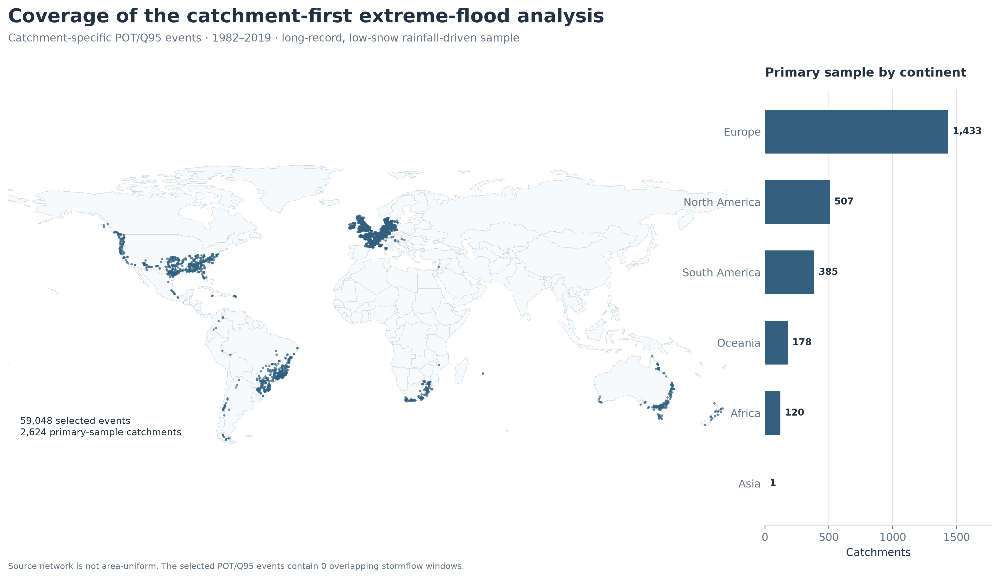
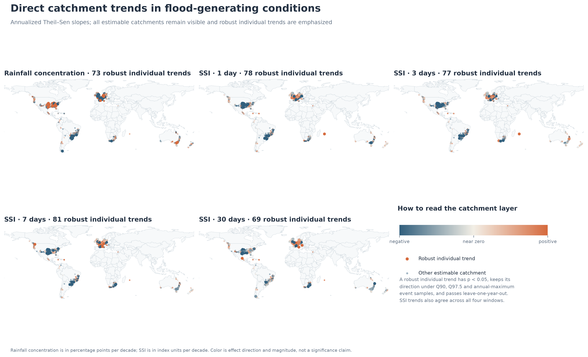
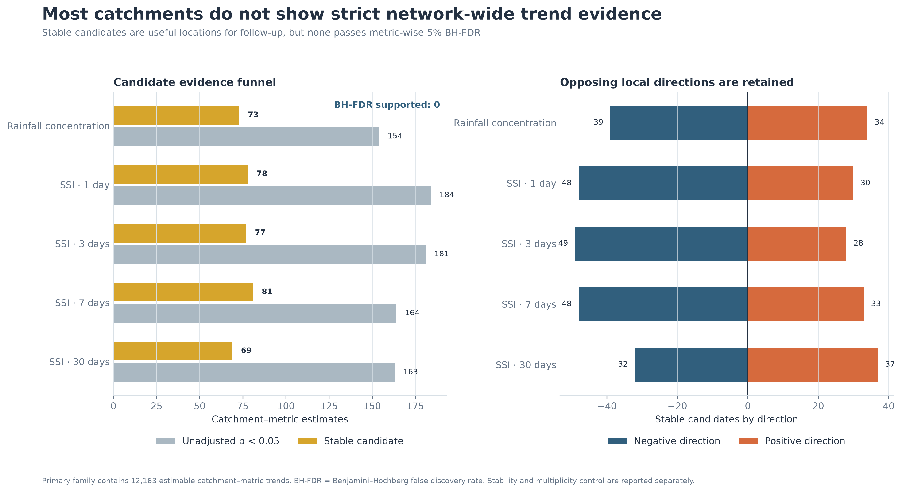
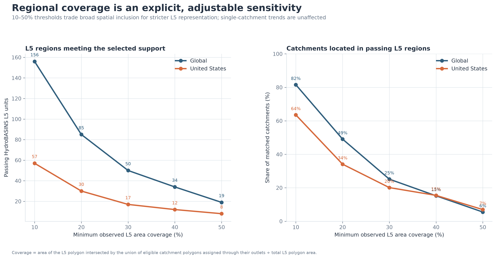
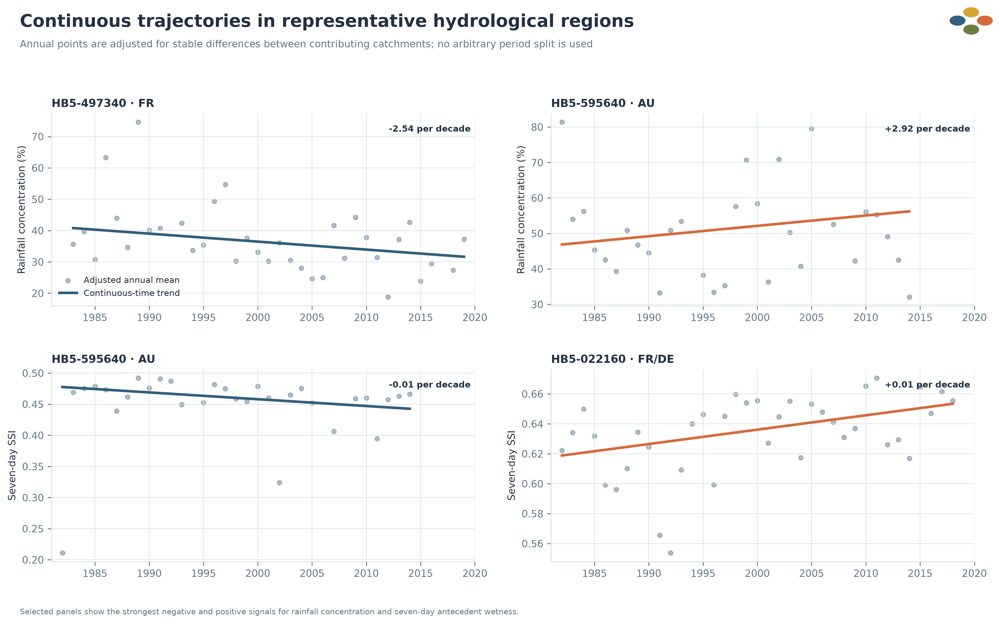
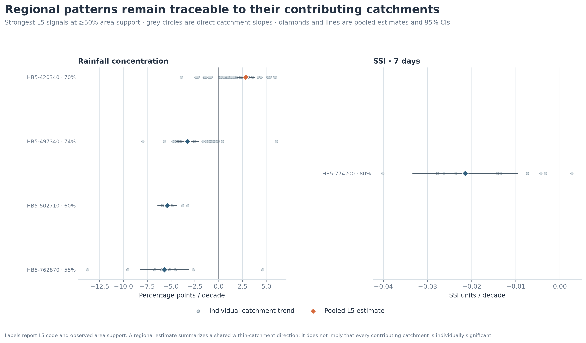

# 全球降雨型大洪水生成条件的长期变化（1982–2019）

**技术报告 · 生成日期：2026-09-01**

## 技术摘要

- 研究首先在单个流域内判断大洪水生成条件是否发生持续变化，再检验这些局地信号是否在 HydroBASINS L5 内形成更大尺度的一致模式。
- 主样本包含 **59,048 场** POT/Q95 大洪水和 **2,624 个**长记录低雪流域；其中 **2,435 个流域**具有足够的所选事件年份，可估计至少一个主指标的单流域趋势。
- 五个连续主指标形成 **12,163 个流域—指标检验**（完整组合为 2,435 × 5 = 12,175；SSI 7日和30日因有效事件年份或时间跨度不足分别缺少 2 项和 10 项，缺失项不记为零）。共有 **378 个稳定候选**，但 **没有单流域信号通过变量内5% FDR**。因此目前的严格结论是：多数流域没有可由该观测网络稳定确认的长期生成条件变化；候选位置用于后续复核，而不是确证清单。
- 区域层在全部 1,475 个 L5—指标检验中有 **106 个**通过完整区域族 FDR，**94 个**同时通过事件样本、SSI时间窗和留一检验。默认 **≥10%** 面积支持后，保留 **84 个强区域信号，分布于 36 个 L5**。
- 面积阈值只限制区域解释，不删除单流域结果。网页允许在 10%、20%、30%、40% 和 50% 之间动态切换。



该图给出研究能够回答问题的观测范围。欧洲和北美明显更密集，因此“全球”指全球分布的可用测站网络，不等于按全球陆地面积加权的总体。

## 1. 研究问题

研究对象是**大洪水发生时的生成条件是否随时间改变**。具体观察两条连续过程维度：事件降雨是否变得更集中或更持久，以及事件开始前流域是否变得更湿或更干。

## 2. 推断顺序

证据按以下顺序形成：

1. 对每个合格流域分别构建大洪水事件样本；
2. 在该流域内部估计连续时间趋势；
3. 保留无趋势、弱证据和稳定候选，不以颜色替代显著性；
4. 将出口位于同一 L5 的流域作为区域汇总；
5. 用面积覆盖率判断该汇总是否有足够空间支持被解释为 L5 模式。

## 3. 已验证的研究时段

洪水事件、日降雨/径流和 GLASS-AVHRR 土壤湿度共同可用的时段为 **1982–2019**。所有时间趋势均使用这一连续记录，不人为设置年份断点。

## 4. 流域总体

流域需满足长期雪贡献小于 0.10、两个季节事件目录均存在、至少30个观测事件年、记录跨度至少30年且年度覆盖率至少80%。通过记录筛选的流域有 **2,839 个**。

## 5. 事件选择与条件描述相互独立

事件是否进入极端样本由洪峰决定；进入样本以后，才计算降雨集中度和前期湿润度。因此较大的降雨集中度不会提高事件被选中的概率，也不会构成循环定义。

## 6. 主事件样本：流域自身 POT/Q95

对流域 $i$ 的全部重建事件洪峰 $Q_{ie}$ 计算长期95%分位数 $Q_{0.95,i}$：

$$
\mathcal E_i^{95}=\{e:Q_{ie}\ge Q_{0.95,i}\}.
$$

每个流域至少需要10场所选事件，且最早和最晚所选事件相距至少20年。主样本最终为 **59,048 场、2,624 个流域**。

**例子。** 若某流域共有100场重建洪水，其洪峰95%分位数为120 mm/day，那么只保留洪峰不小于120 mm/day的上尾事件，通常约5场。POT允许同一年出现多场真正的上尾事件；随后第12节会把同一年的多场事件先取平均，避免该年获得额外趋势权重。

## 7. 为什么不只使用年最大洪水

年最大值强制每年贡献一场事件，可能把相对普通年份的最大洪水与真正极端洪水放在同一总体。POT/Q95更直接地对应每个流域的上尾事件；年最大样本仍作为敏感性分支。

## 8. 极端样本敏感性

四个替代样本为 POT/Q90、POT/Q97.5、10日去簇 POT/Q95 和年最大洪水。主样本中有 2,194 对相邻洪峰间隔小于10日；去簇样本将该数量降为 0。事件风暴径流窗口重叠数为 0。

## 9. 降雨集中度

对事件 $e$：

$$
C_{ie}=\frac{P_{\max,ie}}{P_{\mathrm{volume},ie}}.
$$

$P_{\max}$ 是事件降雨窗口内最大日降雨，$P_{\mathrm{volume}}$ 是整个事件降雨总量。$C$ 增加表示更多事件降雨集中在最湿一天；$C$ 减少表示事件降雨更持久、总量相对更重要。主推断始终使用连续 $C$，不使用二元“强度主导型”标签。

**例子。** 一场洪水事件累计降雨80 mm，其中降雨最多的一天为48 mm，则 $C=48/80=0.60$，即整场降雨的60%落在一天内。若趋势为每十年增加8.83个百分点，表示拟合的集中度例如可由38.00%变为46.83%；这是比例增加8.83个百分点，不是洪水次数增加8.83%，也不是日雨量增加8.83 mm。

## 10. 前期湿润度 SSI

设 $SSI_{i,t-k}$ 为降雨开始前第 $k$ 个完整日的土壤饱和指数，则窗口 $w$ 的指标为：

$$
SSI_{ie}^{(w)}=\frac1w\sum_{k=1}^w SSI_{i,t_{0,ie}-k},
\qquad w\in\{1,3,7,30\}.
$$

正趋势表示大洪水发生前的流域状态长期变湿，负趋势表示长期变干。它不是降雨量、洪峰或体积含水率百分比。

**例子。** 若降雨开始前3个完整日的 SSI 分别为0.32、0.46和0.52，则 $SSI^{(3)}=(0.32+0.46+0.52)/3=0.433$。若3日 SSI 趋势为 $-0.010$/十年，含义是入选大洪水发生前3天的平均前期湿润状态每十年降低0.010个指数单位。

## 11. 降雨物理分量

最大日降雨、事件总降雨和降雨持续时间直接以毫米或日为单位拟合。其相对变化仅由原始线性斜率除以相应长期均值获得：

$$
r=100\frac{\widehat\beta}{\bar y}.
$$

这里不使用对数模型。分量用于解释降雨集中度为何变化，不单独承担“洪水原因”的因果归因。

**例子。** 若某区域事件总降雨的长期均值为100 mm，线性斜率为每十年增加8 mm，则相对变化为 $100\times8/100=8\%$/十年。这里仍然先报告“+8 mm/十年”这个物理量；8%只是便于比较不同量纲或不同平均水平的辅助表达。

## 12. 为什么先按流域—年份汇总

同一流域一年可能出现多场 POT 事件。首先计算：

$$
\bar y_{it}=\frac1{n_{it}}\sum_e y_{iet}.
$$

这样每个有观测的事件年获得相同时间权重，避免某一年因为事件较多而主导趋势。

**例子。** 某流域在2005年有3场入选洪水，其集中度为40%、55%和65%，则2005年的趋势输入为 $(40+55+65)/3=53.3\%$，而不是把2005年当成3个独立年份。若2006年只有1场事件，2005和2006在时间趋势中各贡献一个年度值。

## 13. 单流域趋势

对每个流域的年度序列使用 Theil–Sen 斜率：

$$
\widehat\beta_i=\operatorname{median}_{t_j>t_k}
\frac{\bar y_{it_j}-\bar y_{it_k}}{t_j-t_k}\times10.
$$

并使用含并列值修正的 Mann–Kendall 检验判断是否存在单调趋势。至少需要10个有事件的年份，且这些年份跨度至少20年。

**例子。** 若某一对年度值从1990年的0.40升至2010年的0.52，这一对年份给出的斜率为 $(0.52-0.40)/(2010-1990)\times10=0.06$/十年，即集中度每十年增加6个百分点。Theil–Sen 不只用首末两点，而是计算所有年份对的斜率并取中位数，因此不容易被某一个异常年份牵动。

## 14. 单流域多重检验

每个物理指标分别形成一个跨流域的 Benjamini–Hochberg 检验族。将 $m$ 个 p 值排序为 $p_{(1)}\le\cdots\le p_{(m)}$，寻找最大的 $k$ 满足：

$$
p_{(k)}\le\frac{k}{m}\alpha,
\qquad \alpha=0.05.
$$

该步骤控制同一指标地图中被拒绝原假设集合的预期错误发现比例。

**例子。** 若同一指标检验1,000个流域，第5小的 p 值对应阈值 $(5/1000)\times0.05=0.00025$。只有当排序后的 p 值足够小，才会被标为通过跨流域 FDR。它不改变任何单流域斜率，只避免在上千次同时检验中把随机小 p 值误当成可靠发现。

## 15. 单流域稳定候选

“稳定候选”同时要求主样本未校正 $p<0.05$，POT/Q90 与 POT/Q97.5 方向一致，10日去簇方向一致，年最大样本方向一致，留一年后方向不变；SSI 还需四个时间窗方向一致。候选是有针对性的后续研究对象，不等于通过 FDR 的严格信号。



图中浅色位置是可估计的单流域趋势，描边位置是稳定候选。所有方向均保留；没有用分类阈值把连续变化压缩成“有/无机制”。

## 16. 单流域结果

| 指标 | 可估计流域 | 未校正 p<0.05 | 稳定候选 | 变量内FDR | 候选负向 | 候选正向 |
|---|---:|---:|---:|---:|---:|---:|
| 降雨集中度 | 2,435 | 154 | 73 | 0 | 39 | 34 |
| 前期湿润度 SSI（1日） | 2,435 | 184 | 78 | 0 | 48 | 30 |
| 前期湿润度 SSI（3日） | 2,435 | 181 | 77 | 0 | 49 | 28 |
| 前期湿润度 SSI（7日） | 2,433 | 164 | 81 | 0 | 48 | 33 |
| 前期湿润度 SSI（30日） | 2,425 | 163 | 69 | 0 | 32 | 37 |

## 17. 单流域主要结论

共有 **378 个稳定候选**，同时包含增加和减少方向；**变量内 FDR 通过数为0**。因此本研究不支持“全球大多数流域都存在长期生成条件变化”，而支持“多数流域缺少严格长期证据，少数位置值得进一步核验”。



该图将未校正显著、稳定候选和 FDR 证据分开，避免把稳健性和多重检验混为同一概念。

## 18. L5 是第二层空间问题

L5 分析回答：多个局地流域的变化是否可能属于同一个更大尺度水文现象。它不决定一个单流域结果是否有价值，也不覆盖或删除单流域图层。

## 19. 流域到 L5 的对应

每个流域通过出口经纬度对应到 HydroBASINS v1.c L5。主样本中 2,622 个流域匹配成功；2个毛里求斯流域没有匹配到当前 L5 参考边界，但仍保留单流域结果。

## 20. L5 面积支持率

设 $H_j$ 为 L5 多边形，$A_i$ 为出口落在该 L5 的合格流域多边形，则：

$$
Coverage_j=
\frac{Area\left(H_j\cap\bigcup_{i\in j}A_i\right)}{Area(H_j)}.
$$

计算使用 EPSG:6933 等面积投影，并先修复无效 polygon。重叠流域通过几何并集只计一次。

**例子。** 若一个 L5 面积为10,000 km²，落入其中的合格流域多边形在该 L5 内的去重并集面积为2,400 km²，则面积支持率为24%。它通过10%和20%门槛，但不通过30%、40%或50%门槛。

## 21. 动态面积阈值

| L5面积覆盖阈值 | 有空间支持的L5 | 有趋势结果的L5 | 位于这些L5的流域 | 全球流域占比 | 美国流域占比 | 强区域信号 | 涉及L5 |
|---:|---:|---:|---:|---:|---:|---:|---:|
| 10% | 156 | 152 | 2,139 | 81.6% | 63.6% | 84 | 36 |
| 20% | 85 | 82 | 1,287 | 49.1% | 34.1% | 42 | 22 |
| 30% | 50 | 48 | 660 | 25.2% | 20.1% | 28 | 16 |
| 40% | 34 | 32 | 399 | 15.2% | 15.5% | 19 | 11 |
| 50% | 19 | 18 | 145 | 5.5% | 7.0% | 10 | 6 |

10%门槛用于网页默认视图，以保留较广的区域探索范围；20%–50%允许读者检验结论如何随空间代表性要求收紧。阈值是空间解释条件，不是统计显著性条件。



图中下降曲线定量展示区域代表性与样本保留之间的取舍。美国的 L5 划分较碎，因此相同阈值下保留比例低于全球观测网络。

## 22. 多流域 L5 模型

对至少两个贡献流域的 L5，拟合流域固定效应趋势：

$$
\bar y_{it}=\alpha_i+\beta_j x_{it}+\varepsilon_{it},
\qquad x_{it}=\frac{year_{it}-2000}{10}.
$$

$\alpha_i$ 控制不同流域长期水平差异，$\beta_j$ 表示该 L5 内共同的每十年变化。标准误按流域聚类并使用 $t(G-1)$ 参考。

**例子。** 同一 L5 内两个流域的长期平均集中度分别为35%和55%，但两者都大致每十年增加2个百分点。固定效应先保留35%与55%的基线差异，再估计共同的 $\beta_j\approx+2$ 个百分点/十年；不会因为第二个流域本来更高就把它误判成时间变化。

## 23. 单流域占据一个 L5 的情况

若一个 L5 只有一个贡献流域但面积支持率达到所选阈值，则区域面板直接继承该流域的 Theil–Sen 结果，并标记为“单流域代表”。它说明该流域覆盖该 L5 的空间比例足够高，但不构成多个流域相互验证。

## 24. 年份中心化中的2000

2000只用于将时间变量中心化。替换为1990或2010不会改变斜率；模型没有把2000年视为突变点，也没有进行2000年前后分段比较。

**例子。** 1990年对应 $x=-1$，2010年对应 $x=+1$，二者相差2个“十年”。若改以1990年为中心，它们会变成0和2，差仍为2，因此斜率不变；只有截距的写法改变。

## 25. 完整区域检验族

全部 1,475 个“可估计 L5 × 五个主指标”共同进入一个 BH FDR 检验族。完整族比按指标分别校正更保守，目的是避免从多个空间单元和多个湿润度时间窗中挑选偶然显著结果。

## 26. 五个区域证据门

网页中的强区域信号同时满足：

1. 当前所选 L5 面积支持率；
2. 完整区域族 5% FDR；
3. 四个替代极端事件样本方向一致；
4. SSI 的1/3/7/30日时间窗方向一致（降雨集中度该项自动满足）；
5. 多流域 L5 留一流域后方向不变；单流域代表则使用留一年检验。

## 27. 默认10%面积支持下的区域结果

| 指标 | L5检验 | 完整区域族FDR | 强区域信号 | 负向 | 正向 |
|---|---:|---:|---:|---:|---:|
| 降雨集中度 | 152 | 27 | 24 | 19 | 5 |
| 前期湿润度 SSI（1日） | 152 | 18 | 16 | 13 | 3 |
| 前期湿润度 SSI（3日） | 152 | 15 | 14 | 11 | 3 |
| 前期湿润度 SSI（7日） | 152 | 18 | 16 | 12 | 4 |
| 前期湿润度 SSI（30日） | 152 | 14 | 14 | 12 | 2 |



区域层同时出现正向和负向结果。它说明一些局地变化在空间上可以聚合为共享方向，但不支持统一的全球平均变化方向。

## 28. 最强区域结果

| L5 | 指标 | 方向 | 每十年变化 | 95% CI | 面积支持 | 流域数 |
|---|---|---|---:|---:|---:|---:|
| HB5-762870 | 前期湿润度 SSI（3日） | 减少 | -0.030 | -0.043 to -0.017 | 55.5% | 9 |
| HB5-762870 | 前期湿润度 SSI（1日） | 减少 | -0.030 | -0.042 to -0.017 | 55.5% | 9 |
| HB5-632730 | 前期湿润度 SSI（3日） | 减少 | -0.029 | -0.042 to -0.015 | 13.3% | 11 |
| HB5-632730 | 前期湿润度 SSI（1日） | 减少 | -0.029 | -0.042 to -0.015 | 13.3% | 11 |
| HB5-048410 | 前期湿润度 SSI（7日） | 减少 | -0.029 | -0.043 to -0.014 | 24.8% | 8 |
| HB5-762870 | 降雨集中度 | 减少 | -5.69 | -8.23 to -3.14 | 55.5% | 9 |
| HB5-502710 | 降雨集中度 | 减少 | -5.40 | -6.43 to -4.36 | 60.0% | 4 |
| HB5-774200 | 前期湿润度 SSI（1日） | 减少 | -0.027 | -0.042 to -0.011 | 80.4% | 11 |
| HB5-048410 | 前期湿润度 SSI（3日） | 减少 | -0.027 | -0.040 to -0.013 | 24.8% | 8 |
| HB5-048620 | 前期湿润度 SSI（3日） | 减少 | -0.026 | -0.036 to -0.016 | 45.6% | 16 |
| HB5-632730 | 前期湿润度 SSI（7日） | 减少 | -0.025 | -0.037 to -0.014 | 13.3% | 11 |
| HB5-048620 | 前期湿润度 SSI（1日） | 减少 | -0.025 | -0.036 to -0.015 | 45.6% | 16 |

## 29. 区域结果如何回到单流域



灰点是同一 L5 内各单流域斜率，菱形及区间是 L5 共同斜率和95%置信区间。区域显著不要求每一个单流域独立显著；它利用方向相近的多流域年度变化提高检验能力。

## 30. 支持的科学结论

1. 多数可估计单流域没有通过网络范围的严格长期趋势证据；
2. 378个稳定候选提供了明确的后续复核位置；
3. 一些候选及弱单流域变化在 L5 中形成统计上更清晰的共享方向；
4. 区域信号随面积支持阈值收紧而减少，但方向相反的局地模式始终并存。

## 31. 不能由当前设计推出的结论

结果不能直接解释为洪水发生次数、洪峰或洪量的变化，也不能直接归因于人为气候变化、土地利用或工程调控。面积覆盖率衡量观测空间支持，不衡量人口、资产或全球陆地代表性。

## 32. 主要限制

亚洲长期流域明显不足；降雨集中度只有日尺度分辨率；SSI 和重建降雨误差会进入事件指标；L5 之间可能存在空间相关；聚类稳健推断在流域数很少时仍不精确。单流域候选尤其需要独立数据或更长记录复核。

## 33. 下一步

优先对稳定候选和强 L5 信号开展原始时间序列复核、独立降雨/土壤湿度产品验证和局地机制解释；随后再评估更细 HydroBASINS 层级是否能在保持较高面积支持率的同时提高空间分辨率。

## 34. 可复现入口

```powershell
$projectPython = 'D:/Program Files/python-envs/Global_Flood_Cause_Evolution/Scripts/python.exe'
& $projectPython src/run_pipeline.py --stage all --force
& $projectPython src/validate_outputs.py
```

源项目 `Event_Typology` 按只读路径复用；本仓库保存方法、派生结果、图表、报告和 GitHub Pages 数据。交互网页：<https://grups666.github.io/Global_Flood_Cause_Evolution/>。
